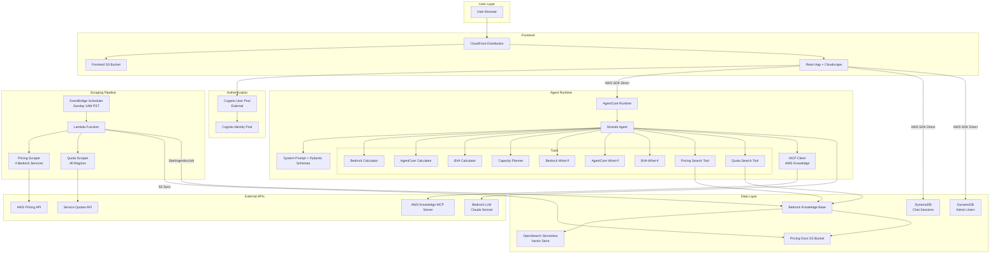

# Design Document: AWS GenAI TCO & ROI Analyst

## Overview

The AWS GenAI TCO & ROI Analyst is a full-stack chat agent solution that estimates Amazon Bedrock and Amazon Bedrock AgentCore costs, performs capacity planning, and delivers Total Cost of Ownership (TCO) and Return on Investment (ROI) analysis. The system comprises four components:

1. **AnalystAgent** — A Strands-based AI agent deployed on Amazon Bedrock AgentCore with calculator tools, Knowledge Base search tools, and an MCP client for AWS documentation lookups.
2. **Infrastructure Stack (CFN)** — A single CloudFormation template provisioning S3, OpenSearch Serverless, Bedrock Knowledge Base, DynamoDB, CloudFront, Cognito Identity Pool, Lambda (scheduled scraping), and EventBridge.
3. **Chatbot UI** — A React application using Cloudscape Design components with Cognito authentication, session management, rich markdown/chart rendering, and an Express proxy server.
4. **Data Scrapers** — Python scripts that scrape AWS pricing data (4 Bedrock services, all regions) and Bedrock quota data (all regions), triggered weekly by EventBridge + Lambda, syncing output to S3 and triggering Knowledge Base ingestion.

The agent receives natural-language questions via the chatbot UI, retrieves live pricing/quota data from the Knowledge Base, invokes the appropriate calculator tools, and returns structured JSON responses that the UI renders as tables, charts, and collapsible verification sections.

## Architecture



### Key Architectural Decisions

1. **Direct AWS SDK from Browser**: The React app uses Cognito Identity Pool credentials to call DynamoDB and AgentCore directly from the browser, eliminating the need for a persistent backend server in production. The Express proxy server (`server/index.js`) exists for local development.

2. **Pure Computation Tools**: All calculator tools (Bedrock, AgentCore, BVA, Capacity Planner) are pure functions with no AWS API calls. They receive pricing data as parameters from the agent, which first retrieves it via the Knowledge Base search tools.

3. **Knowledge Base as Single Source of Truth**: Pricing and quota data is scraped, stored in S3, and indexed into a Bedrock Knowledge Base with OpenSearch Serverless. The agent queries this KB rather than calling pricing APIs at runtime, ensuring consistent and fast retrieval.

4. **Scheduled Scraping Pipeline**: An EventBridge rule triggers a Lambda function weekly that runs both scrapers, syncs to S3, and triggers KB re-ingestion. This keeps data fresh without manual intervention.

5. **No Hardcoded Account Values**: All account-specific values (Cognito IDs, KB IDs, etc.) are parameterized via CloudFormation parameters or environment variables. The CFN template's Cognito defaults must be replaced with `REPLACE_ME` placeholders.

## Components and Interfaces

### 1. AnalystAgent (`AnalystAgent/app/AnalystAgent/`)

**Entrypoint** (`main.py`):
- `BedrockAgentCoreApp` with async entrypoint accepting `{prompt: string}` payload
- Initializes Strands `Agent` with model, system prompt, all tools, and MCP tools
- `invoke_with_retry()` handles throttling with exponential backoff (3 retries)
- Streams responses via `agent.stream_async(prompt)`

**Model Loader** (`model/load.py`):
- Reads `MODEL_ID` from environment variable, defaults to Claude Sonnet 4.5
- Returns `BedrockModel` instance with temperature 0.1

**System Prompt** (`system_prompt.py`):
- Defines `BedrockCosts`, `AgentCoreCosts`, `BusinessValue` Pydantic schemas
- Contains `TCO_ANALYST_PROMPT` with pricing data requirements, verification rules, conversational workflow instructions, capacity planning methodology, and JSON response format

**Calculator Tools**:

| Tool | File | Input | Output |
|------|------|-------|--------|
| `use_bedrock_calculator` | `calculator_bedrock.py` | `{questions_per_month, model configs with pricing, vector_database, tools}` | Per-model costs, token breakdowns, step-by-step explanations |
| `bedrock_what_if_analysis` | `calculator_bedrock.py` | `{base_params, primary_variable, primary_range, secondary_variable?, secondary_range?}` | 1D/2D cost sensitivity matrix |
| `use_agentcore_calculator` | `calculator_agentcore.py` | `{questions_per_day, component configs: runtime, browser, code_interpreter, gateway, memory}` | Per-component costs, total, explanations |
| `agentcore_what_if_analysis` | `calculator_agentcore.py` | Same pattern as bedrock what-if | 1D/2D cost sensitivity matrix |
| `bva_calculator` | `calculator_bva.py` | `{questions_per_month, ai_agent_cost_per_month, cost_savings?, revenue_growth?, customer_churn_reduction?, implementation_costs?}` | ROI, payback period, net value, explanations |
| `bva_what_if_analysis` | `calculator_bva.py` | Same pattern as bedrock what-if | 1D/2D ROI/payback sensitivity matrix |
| `capacity_planning_calculator` | `calculator_capacity_planning.py` | `{model_name, max_rpm, max_tpm, pricing params, steady/peak usage params}` | Capacity analysis, cost estimation, provisioned throughput comparison |

**Search Tools**:

| Tool | File | Interface |
|------|------|-----------|
| `call_pricing_search_agent` | `search_pricing_info.py` | `(query: str, target_region: str) -> str` — Hybrid vector search on KB filtered to `/pricing_data/{region}/`, returns up to 15 results with score ≥ 0.2 |
| `call_bedrock_quota_agent` | `search_bedrock_quota.py` | `(query: str, target_region: str) -> str` — Hybrid vector search on KB filtered to `/quota_data/{region}/`, returns up to 10 results with score ≥ 0.2 |

**MCP Client** (`mcp_client/client.py`):
- Connects to `https://knowledge-mcp.global.api.aws` via Streamable HTTP
- Provides AWS documentation lookup tools to the agent

### 2. Infrastructure Stack (`cfn/aws-tco-biz-value-analysis.yaml`)

**Parameters** (all account-specific values parameterized):
- `EmbeddingModelId` (default: `amazon.titan-embed-text-v2:0`)
- `EmbeddingDimension` (default: 1024)
- `CognitoUserPoolId` — must be changed to `REPLACE_ME` (Requirement 20)
- `CognitoClientId` — must be changed to `REPLACE_ME` (Requirement 20)
- `CognitoDomain` — must be changed to `REPLACE_ME` (Requirement 20)
- `AgentRuntimeName` (default: `aws_tco_biz_value_analyst`)

**Resources Created**:
- `PricingDocsBucket` — S3 with AES256 encryption, public access blocked
- `ChatSessionsTable` — DynamoDB (userId PK, sessionId SK, PITR enabled)
- `AdminUsersTable` — DynamoDB (userId PK)
- OpenSearch Serverless collection (`pricing-kb-collection`) with FAISS HNSW index
- `IndexWaitFunction` — Lambda custom resource that polls until the OpenSearch index is ready
- `PricingKnowledgeBase` — Bedrock KB connected to OpenSearch and S3
- `PricingDataSource` — S3 data source with chunking strategy NONE
- `FrontendBucket` — S3 for React build
- `CloudFrontDistribution` — HTTPS, OAC, SPA error routing (403/404 → index.html)
- `CognitoIdentityPool` — Issues temporary AWS credentials for DynamoDB + AgentCore access

**New Resources Required** (Requirement 16):
- `ScraperLambdaRole` — IAM role with S3 put/delete, Bedrock StartIngestionJob, Service Quotas ListServiceQuotas, outbound HTTPS
- `ScraperLambdaFunction` — Python 3.12 Lambda (15-min timeout) that runs both scrapers, syncs to S3, triggers KB sync
- `ScraperScheduleRule` — EventBridge Scheduler with cron `cron(0 9 ? * SUN *)` (9 AM UTC = 1 AM PST)

### 3. Chatbot UI (`chatbot-ui/`)

**React App** (`src/App.jsx`):
- Cognito Hosted UI redirect flow for authentication
- Token exchange → user info → Identity Pool credentials
- Session sidebar (sorted by most recent, shows title + timestamp)
- New Conversation creates UUID-based session ID
- Session loading from DynamoDB
- Message persistence with Eastern Time timestamps

**Chat Panel** (referenced from `App.jsx`):
- Model selector dropdown (restricted set for non-admins, full set for admins)
- Admin check via `tco-bva-admin-users` DynamoDB table
- Conversation history context: up to 20 recent messages, each truncated to 2000 chars
- Chart keyword detection appends chart rendering instructions
- Markdown rendering with remark-gfm
- JSON code block rendering as Cloudscape tables
- Verification section extraction into collapsible expander
- Recharts integration for bar, pie, donut, line, area, stacked bar, grouped bar, radar, heatmap

**Express Proxy Server** (`server/index.js`):
- Local development server on port 3001
- Discovers AgentCore runtime ARN by name
- Builds prompt with conversation history (up to 20 messages, 2000 char truncation)
- Chart keyword detection via regex
- DynamoDB persistence for messages
- Health check endpoint

### 4. Data Scrapers (`doc_scrapers/`)

**Pricing Scraper** (`pricing-doc-scraper/price_doc_scraper.py`):
- Fetches AWS pricing index from `https://pricing.us-east-1.amazonaws.com/offers/v1.0/aws/index.json`
- Targets 4 services: `AmazonBedrock`, `AmazonBedrockAgentCore`, `AmazonBedrockService`, `AmazonBedrockFoundationModels`
- Saves files as `{output_dir}/{service}/{region}/{product_name}_{sku}.txt`
- Default: ALL regions (no region filtering when `regions_filter=None`)
- Sanitizes filenames (invalid chars removed, 200 char cap)

**Quota Scraper** (`quota-doc-scraper/quota_doc_scraper.py`):
- Queries Service Quotas API for Bedrock service quotas
- Filters to RPM/TPM quotas only, excludes model customization quotas
- Classifies by inference type (on-demand, cross-region, global-cross-region) and metric (rpm, tpm)
- Saves as `{output_dir}/{region}/{sanitized_quota_name}.txt` with `_summary.json` per region
- Exponential backoff retry (up to 3) on throttling
- 1-second delay between regions
- Default regions list exists but `--all-regions` flag discovers all regions dynamically

## Data Models

### DynamoDB: Chat Sessions Table (`tco-bva-chat-sessions`)

```
{
  userId: string (PK),          // User email or username
  sessionId: string (SK),       // UUID-based session ID
  title: string,                // First message truncated to 80 chars
  messages: [
    {
      role: "user" | "assistant",
      content: string,
      timestamp: string          // Eastern Time: "YYYY-MM-DD HH:MM:SS"
    }
  ],
  createdAt: string,            // Eastern Time timestamp
  updatedAt: string             // Eastern Time timestamp
}
```

### DynamoDB: Admin Users Table (`tco-bva-admin-users`)

```
{
  userId: string (PK)           // User email or username
}
```

### Pydantic Response Schemas

**BedrockCosts**:
```python
{
  questions_per_month_all_models: int,
  assumptions: {global: {system_prompt_tokens: int, history_qa_pairs: int}},
  warnings: Optional[List[str]],
  total_cost_for_all_models: float,
  # Dynamic model keys (model1, model2, etc.) with:
  #   model_name, costs, assumptions, token_breakdown, calculation_explanations
}
```

**AgentCoreCosts**:
```python
{
  runtime: Optional[Dict],      # cpu_cost, memory_cost, total_cost, explanations
  browser: Optional[Dict],
  code_interpreter: Optional[Dict],
  gateway: Optional[Dict],      # invoke_tool_cost, search_api_cost, indexing_cost
  memory: Optional[Dict],       # short_term_cost, long_term_storage_cost, long_term_retrieval_cost
  total_all_components: float
}
```

**BusinessValue**:
```python
{
  assumptions: Dict,
  business_value_summary: {
    benefits: {total_gross_benefits, time_savings_benefit, churn_reduction_benefit},
    costs: {total_costs, one_time_implementation_costs, recurring_ai_costs_over_period},
    net_results: {net_value_over_period, roi_percent, payback_months},
    monthly_ongoing: {monthly_gross_benefit, monthly_ai_costs, monthly_net_benefit}
  },
  cost_savings: Optional[Dict],
  revenue_growth: Optional[Dict],
  customer_churn_reduction: Optional[Dict],
  implementation_costs: Optional[Dict]
}
```

### S3 Data Structures

**Pricing Data** (`s3://{bucket}/pricing_data/`):
```
pricing_data/{ServiceName}/{region_code}/{product_name}_{sku}.txt
```
Each file contains: SKU, service, region, attributes, on-demand pricing, reserved pricing.

**Quota Data** (`s3://{bucket}/quota_data/`):
```
quota_data/{region}/{sanitized_quota_name}.txt
quota_data/{region}/_summary.json
```
Each file contains: quota name, code, region, inference type, metric, value, unit, adjustability, global quota status.

### Knowledge Base Configuration

- **Embedding Model**: Titan Embed Text v2 (1024 dimensions)
- **Vector Store**: OpenSearch Serverless with FAISS HNSW index (efConstruction=512, M=16, L2 space)
- **Chunking Strategy**: NONE (each scraped file = one document)
- **Search Type**: HYBRID (vector + keyword)
- **Filters**: S3 source URI path-based filtering (`/pricing_data/` or `/quota_data/` + `/{region}/`)


## Correctness Properties

*A property is a characteristic or behavior that should hold true across all valid executions of a system — essentially, a formal statement about what the system should do. Properties serve as the bridge between human-readable specifications and machine-verifiable correctness guarantees.*

### Property 1: Retry with exponential backoff on throttling

*For any* sequence of consecutive throttling/service-unavailable errors of length N, `invoke_with_retry` should attempt exactly min(N, 4) calls (1 initial + up to 3 retries). If N ≤ 3, the function should succeed on the (N+1)th call. If N > 3, the function should raise the error after the 4th attempt.

**Validates: Requirements 1.6**

### Property 2: Search result formatting contains all required fields

*For any* list of Knowledge Base retrieval results (with content, score, source_uri, and metadata fields), the formatted output string from either `call_pricing_search_agent` or `call_bedrock_quota_agent` should contain for each result: a sequential result number, the numeric score, the content text, and the source URI.

**Validates: Requirements 2.3, 3.3**

### Property 3: Bedrock calculator model cost summation invariant

*For any* valid Bedrock calculator input with one or more model configurations and a positive `questions_per_month`, the `total_cost_for_all_models` field in the result should equal the sum of each model's `costs.total_token_cost`.

**Validates: Requirements 4.1**

### Property 4: Bedrock calculator token breakdown consistency

*For any* valid model configuration (with optional vector_database and tools), the `token_breakdown.total_input_tokens` should equal the sum of `query_input_tokens_per_month` + `vector_tokens_added` + `tool_input_tokens_added` + `system_prompt_tokens_added` + `history_tokens_added`, and `token_breakdown.total_output_tokens` should equal `query_output_tokens_per_month` + `tool_output_tokens_added`.

**Validates: Requirements 4.2, 4.3**

### Property 5: Bedrock calculator default question distribution

*For any* set of N model configurations where none specify `percent_questions_for_model`, each model should receive exactly `100/N` percent of the total questions.

**Validates: Requirements 4.4**

### Property 6: Bedrock calculator percentage allocation warnings

*For any* set of model configurations where the sum of `percent_questions_for_model` values exceeds 100%, the result should contain a non-empty `warnings` list. *For any* set where the sum is less than 100%, the result should contain an informational note in `warnings`.

**Validates: Requirements 4.5, 4.6**

### Property 7: Bedrock calculator missing required parameter error

*For any* model configuration missing one of `model_name`, `cost_per_million_input_tokens`, or `cost_per_million_output_tokens`, the calculator should return a result containing an `error` key identifying the missing parameter.

**Validates: Requirements 4.8**

### Property 8: Bedrock calculator tools_passed_to_model capping

*For any* model configuration where `tools.tools_passed_to_model` exceeds `tools.number_of_tools`, the effective tool description tokens used in the calculation should be based on `number_of_tools` (not the uncapped value), verifiable through the token breakdown.

**Validates: Requirements 4.9**

### Property 9: AgentCore calculator component cost summation invariant

*For any* valid AgentCore calculator input with one or more components, the `total_all_components` field should equal the sum of each included component's `total_cost`. Additionally, for each component, its `total_cost` should equal the sum of its sub-costs (e.g., runtime: `cpu_cost + memory_cost`; gateway: `invoke_tool_cost + search_api_cost + indexing_cost`; memory: `short_term_cost + long_term_storage_cost + long_term_retrieval_cost`).

**Validates: Requirements 5.1, 5.2, 5.3, 5.4, 5.7**

### Property 10: AgentCore calculator missing required parameter error

*For any* AgentCore component configuration missing a required pricing parameter (e.g., `cost_per_vcpu_hour` for runtime), the calculator should return a result containing an `error` key.

**Validates: Requirements 5.6**

### Property 11: BVA calculator ROI formula consistency

*For any* valid BVA calculator input with `questions_per_month > 0` and `ai_agent_cost_per_month >= 0`, the `business_value_summary.net_results.net_value_over_period` should equal `total_gross_benefits - total_costs`, and `roi_percent` should equal `(net_value / total_costs) * 100` when `total_costs > 0`.

**Validates: Requirements 6.1, 6.6**

### Property 12: BVA calculator cost savings computation

*For any* valid BVA input with a `cost_savings` component where `minutes_per_question_without_ai > minutes_per_question_with_ai`, the `monthly_gross_labor_savings` should equal `(effective_questions_saving_time * time_saved_per_question / 60) * labor_cost_per_hour`.

**Validates: Requirements 6.2**

### Property 13: BVA calculator revenue growth computation

*For any* valid BVA input with a `revenue_growth` component, the `monthly_gross_additional_revenue` should equal `time_allocated_to_new_projects_hours * revenue_per_employee_per_hour`, where time allocated is derived from total time saved multiplied by `percent_time_to_new_projects`.

**Validates: Requirements 6.3**

### Property 14: BVA calculator customer churn reduction computation

*For any* valid BVA input with a `customer_churn_reduction` component where `customer_churn_before_ai > customer_churn_after_ai`, the `monthly_total_churn_value` should equal `monthly_revenue_retained + monthly_acquisition_cost_avoided`.

**Validates: Requirements 6.4**

### Property 15: BVA calculator error on non-saving AI

*For any* BVA input where `minutes_per_question_with_ai >= minutes_per_question_without_ai` and a `cost_savings` component is provided, the calculator should return a result containing an `error` key.

**Validates: Requirements 6.8**

### Property 16: BVA calculator error on non-reducing churn

*For any* BVA input where `customer_churn_after_ai >= customer_churn_before_ai` and a `customer_churn_reduction` component is provided, the calculator should return a result containing an `error` key.

**Validates: Requirements 6.9**

### Property 17: Capacity planner utilization percentage correctness

*For any* valid capacity planner input with `max_rpm > 0` and `max_tpm > 0`, the `rpm_utilization_pct` should equal `(required_rpm / max_rpm) * 100` and `rpm_sufficient` should equal `required_rpm <= max_rpm` (and analogously for TPM).

**Validates: Requirements 7.1, 7.2**

### Property 18: Capacity planner monthly cost estimation

*For any* valid on-demand text model capacity planner input with pricing data, the `combined_monthly_cost` should equal `(monthly_input_tokens / 1M) * price_per_million_input_tokens + (monthly_output_tokens / 1M) * price_per_million_output_tokens` summed across steady and peak states.

**Validates: Requirements 7.3**

### Property 19: What-if analysis scenario count

*For any* what-if analysis (Bedrock, AgentCore, or BVA) with a primary range of N values and no secondary variable, the result should contain exactly N scenarios. With a secondary range of M values, the result should contain exactly N × M scenarios.

**Validates: Requirements 8.1, 8.2**

### Property 20: What-if analysis dot-notation parameter setting

*For any* what-if analysis with a nested parameter path (e.g., `"model1.input_tokens_per_question"`), the detailed results for each scenario should reflect the varied parameter value at the correct nested location.

**Validates: Requirements 8.3**

### Property 21: Chart keyword detection

*For any* user message string, if it contains a chart-related keyword (bar chart, pie chart, line chart, etc.), the `rewritePromptForCharts` function should return a string containing chart rendering instructions appended to the original message. If no keyword is present, the original message should be returned unchanged.

**Validates: Requirements 12.2**

### Property 22: Conversation history context construction

*For any* message list of length N, the history context builder should include at most 20 messages (the most recent ones), each truncated to 2000 characters, formatted as "User: {content}" or "Assistant: {content}" pairs.

**Validates: Requirements 18.1, 18.2**

### Property 23: Filename sanitization

*For any* input string, the `sanitize_filename` function should return a string that contains no characters from the set `<>:"/\|?*`, has length at most 200 characters, and has no leading/trailing spaces or dots.

**Validates: Requirements 14.6**

### Property 24: Pricing scraper file path structure

*For any* product with a known SKU, service name, and region code, the output file path should match the pattern `{output_dir}/{service_name}/{region_code}/{product_name}_{sku_prefix}.txt`.

**Validates: Requirements 14.3**

### Property 25: Quota scraper inference type and metric classification

*For any* Bedrock quota name string containing "requests per minute" or "tokens per minute", the scraper should classify the metric as "rpm" or "tpm" respectively. For inference type, names containing "global cross-region" should be classified as "global-cross-region", "cross-region" as "cross-region", "on-demand" as "on-demand".

**Validates: Requirements 15.2**

### Property 26: Quota scraper output file content completeness

*For any* scraped quota entry, the output text file should contain all required fields: quota name, quota code, region, inference type, metric, value, unit, adjustable status, and global quota status.

**Validates: Requirements 15.3**

### Property 27: No hardcoded account-specific values in source files

*For any* Python source file, CloudFormation template, or JavaScript source file in the project, scanning for patterns matching AWS account IDs (12-digit numbers in account-ID contexts), Cognito User Pool IDs (region_alphanumeric pattern), and Cognito Client IDs should find no matches (excluding placeholder patterns like `REPLACE_ME` or `<PLACE_YOUR_*>`).

**Validates: Requirements 20.1, 20.2, 20.3**

### Property 28: CFN parameters use placeholder defaults for account-specific values

*For any* CloudFormation parameter that represents an account-specific value (CognitoUserPoolId, CognitoClientId, CognitoDomain), the default value should either be absent or be a clearly marked placeholder (e.g., `REPLACE_ME`), not a real account-specific identifier.

**Validates: Requirements 20.2**

## Error Handling

### Agent Layer
- **Missing prompt**: Returns descriptive error message when payload lacks `prompt` field
- **Throttling/Service Unavailable**: Exponential backoff retry (1s, 2s, 4s) up to 3 retries before propagating the error
- **MCP Client failure**: MCP client context is entered once at startup; if it fails, the agent initializes without MCP tools and logs the error
- **Tool execution errors**: Each calculator tool catches exceptions per-component and returns `{error: string}` with descriptive messages

### Calculator Tools
- **Missing required parameters**: All calculators validate required fields and return `{error: "Missing required parameter: {name}"}` immediately
- **Invalid parameter ranges**: BVA calculator validates non-negative costs, valid percentages (0-100), positive question counts, and returns specific error messages
- **Division by zero**: ROI calculation handles `total_costs == 0` by returning `float('inf')` for ROI; payback handles `monthly_net_benefit <= 0` by returning `float('inf')`
- **Percentage overflow**: Bedrock calculator warns when model percentages exceed 100% but still computes results

### Knowledge Base Search
- **No results**: Returns human-readable "No pricing/quota information found" message
- **API errors**: Catches all exceptions and returns `{error: str(e)}` in the result list
- **Low relevance**: Filters results below minimum score threshold (0.2)

### Scrapers
- **API throttling**: Quota scraper retries with exponential backoff (2^attempt seconds, up to 3 retries)
- **Region failures**: Each region is scraped independently; failures are logged and the scraper continues to the next region
- **Network errors**: Pricing scraper returns `None` from `fetch_json` on any request failure, skipping that service

### Infrastructure
- **OpenSearch index readiness**: Lambda custom resource polls up to 30 times (10s intervals) for index availability before failing the CloudFormation deployment
- **Lambda scraper failures**: The scheduled Lambda should catch errors from each scraper independently, log them, and continue with the other scraper's output

### Chatbot UI
- **Authentication failure**: Displays error message and does not proceed to the chat interface
- **Credential expiration**: Attempts to re-authenticate via Cognito login redirect
- **Session load failure**: Logs error and displays empty message list
- **Agent invocation failure**: Returns error message to the user via the chat interface

## Testing Strategy

### Dual Testing Approach

This project requires both unit tests and property-based tests for comprehensive coverage:

- **Unit tests**: Verify specific examples, edge cases, error conditions, and integration points
- **Property-based tests**: Verify universal properties across randomly generated inputs

### Property-Based Testing Configuration

- **Library**: [Hypothesis](https://hypothesis.readthedocs.io/) for Python, [fast-check](https://fast-check.dev/) for JavaScript/React
- **Minimum iterations**: 100 per property test
- **Tag format**: `Feature: aws-genai-tco-roi-analyst, Property {number}: {title}`
- Each correctness property from the design document maps to exactly one property-based test

### Unit Test Focus Areas

1. **Calculator edge cases**: Zero questions, single model, all components enabled/disabled, boundary percentages
2. **Error conditions**: Missing required parameters, invalid ranges, division by zero scenarios
3. **CloudFormation template validation**: Parse YAML and verify resource properties, parameter definitions, output values
4. **Scraper output format**: Verify file content structure for known sample inputs
5. **UI component behavior**: Model selector list for admin vs non-admin, session creation with UUID

### Property Test Focus Areas

1. **Calculator invariants** (Properties 3, 4, 5, 6, 9, 11, 12, 13, 14, 17, 18): Mathematical consistency of cost calculations using Hypothesis strategies to generate random valid parameter sets
2. **Error handling properties** (Properties 1, 7, 8, 10, 15, 16): Generate invalid inputs and verify correct error responses
3. **What-if analysis** (Properties 19, 20): Generate random parameter ranges and verify scenario counts and parameter propagation
4. **Data pipeline** (Properties 23, 24, 25, 26): Generate random strings/data and verify sanitization, path construction, classification
5. **Security** (Properties 27, 28): Scan actual project files for hardcoded account-specific patterns
6. **UI logic** (Properties 21, 22): Generate random message strings and verify chart detection and history construction

### Test File Organization

```
usecases/aws-genai-tco-roi-analyst/
├── AnalystAgent/app/AnalystAgent/
│   ├── tests/
│   │   ├── test_calculator_bedrock.py          # Properties 3-8, unit tests
│   │   ├── test_calculator_agentcore.py        # Properties 9-10, unit tests
│   │   ├── test_calculator_bva.py              # Properties 11-16, unit tests
│   │   ├── test_calculator_capacity_planning.py # Properties 17-18, unit tests
│   │   ├── test_what_if_analysis.py            # Properties 19-20, unit tests
│   │   ├── test_search_tools.py                # Property 2, unit tests
│   │   └── test_retry_logic.py                 # Property 1, unit tests
├── doc_scrapers/
│   ├── tests/
│   │   ├── test_pricing_scraper.py             # Properties 23-24, unit tests
│   │   └── test_quota_scraper.py               # Properties 25-26, unit tests
├── chatbot-ui/
│   ├── src/__tests__/
│   │   ├── chartDetection.test.js              # Property 21
│   │   └── historyContext.test.js              # Property 22
└── tests/
    └── test_no_hardcoded_values.py             # Properties 27-28
```
