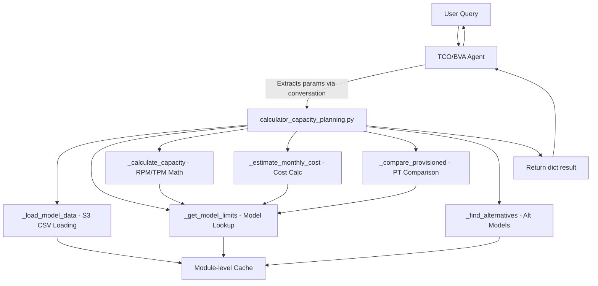

# Design Document: Bedrock Capacity Planning Tool

## Overview

This design describes the extraction and refactoring of the Bedrock Sizer's capacity planning logic into a single Strands `@tool` function (`calculator_capacity_planning.py`) that integrates with the existing TCO/BVA analyst agent. The tool performs model data loading from S3, capacity calculations (RPM/TPM), monthly cost estimation, provisioned throughput comparison, and alternative model discovery — all as pure computation with no Streamlit or LLM dependencies.

The key architectural decision is to consolidate `ModelDataManager`, `CapacityAdvisor`, and `s3_utils` logic into a single self-contained file that follows the existing calculator tool pattern (`calculator_bedrock.py`). The agent handles conversational parameter extraction; this tool only does math and data lookups.

## Architecture



### Data Flow

1. Agent collects parameters from user conversation (model name, region, usage patterns)
2. Agent invokes `capacity_planning_calculator(params)` with structured dict
3. Tool loads CSV data from S3 on first call, caches in module-level variable
4. Tool looks up model limits, calculates capacity, estimates costs
5. Tool returns structured dict with all results
6. Agent formats and presents results to user

### Key Design Decisions

| Decision | Rationale |
|----------|-----------|
| Single file with embedded logic | Follows existing calculator pattern; avoids import chain complexity |
| Module-level data cache | S3 CSV data is static per session; avoids repeated S3 reads |
| No LLM calls for parameter extraction | Agent handles conversation; tool is pure computation |
| No Streamlit dependencies | Tool runs in agent context, not a web app |
| Environment variables for S3 config | Matches deployment pattern; works across environments |
| Dict input/output | Matches `@tool` pattern used by `use_bedrock_calculator` |

## Components and Interfaces

### 1. `capacity_planning_calculator` (Strands @tool function)

The main entry point. Decorated with `@tool`, accepts a single `dict` parameter.

```python
@tool
def capacity_planning_calculator(params: dict) -> dict:
```

**Input Parameters:**

| Parameter | Type | Required | Default | Description |
|-----------|------|----------|---------|-------------|
| `model_name` | str | Yes | — | Bedrock model name |
| `region` | str | No | `us-east-1` | AWS region code |
| `model_type` | str | No | `on_demand` | One of: `on_demand`, `embedding`, `image`, `video`, `provisioned` |
| `cris_flag` | bool | No | `true` | Enable cross-region inference filtering |
| `steady_state_users` | int | No | 10 | Concurrent users (steady) |
| `steady_state_requests_per_hour` | int | No | 600 | Requests/hour/user (steady) |
| `steady_state_usage_hours` | int | No | 8 | Hours/day (steady) |
| `steady_state_usage_days` | int | No | 22 | Days/month (steady) |
| `steady_state_avg_input_tokens` | int | No | 500 | Avg input tokens/request (steady) |
| `steady_state_avg_output_tokens` | int | No | 200 | Avg output tokens/request (steady) |
| `peak_state_users` | int | No | 0 | Concurrent users (peak) |
| `peak_state_requests_per_hour` | int | No | 0 | Requests/hour/user (peak) |
| `peak_state_usage_hours` | int | No | 0 | Hours/day (peak) |
| `peak_state_usage_days` | int | No | 0 | Days/month (peak) |
| `peak_state_avg_input_tokens` | int | No | 0 | Avg input tokens/request (peak) |
| `peak_state_avg_output_tokens` | int | No | 0 | Avg output tokens/request (peak) |
| `steady_state_images_per_minute` | int | No | 0 | Images/min (image models, steady) |
| `peak_state_images_per_minute` | int | No | 0 | Images/min (image models, peak) |
| `steady_state_videos_per_hour` | int | No | 0 | Videos/hour (video models, steady) |
| `steady_state_videos_duration` | int | No | 0 | Avg video seconds (video models, steady) |
| `peak_state_videos_per_hour` | int | No | 0 | Videos/hour (video models, peak) |
| `peak_state_videos_duration` | int | No | 0 | Avg video seconds (video models, peak) |

**Output Structure:**

```python
{
    "model_name": str,
    "region": str,
    "model_type": str,
    "capacity_analysis": {
        "steady_state": {
            "required_rpm": float,
            "required_tpm": float,  # 0 for image/video
            "model_max_rpm": float,
            "model_max_tpm": float,  # 0 for image/video
            "rpm_sufficient": bool,
            "tpm_sufficient": bool,
            "rpm_utilization_pct": float,
            "tpm_utilization_pct": float
        },
        "peak_state": { ... same structure ... } | None
    },
    "cost_estimation": {
        "steady_state": {
            "monthly_input_tokens": float,
            "monthly_output_tokens": float,
            "input_cost": float,
            "output_cost": float,
            "total_monthly_cost": float
        },
        "peak_state": { ... } | None,
        "combined_monthly_cost": float
    },
    "provisioned_throughput": {  # None if not available
        "units_needed": int,
        "no_commitment_monthly": float,
        "one_month_commitment_monthly": float,
        "six_month_commitment_monthly": float,
        "on_demand_comparison": {
            "on_demand_monthly": float,
            "cheapest_provisioned_monthly": float,
            "savings_pct": float
        }
    },
    "alternative_models": [
        {
            "model_name": str,
            "max_rpm": float,
            "max_tpm": float,
            "price_per_million_input_tokens": float,
            "price_per_million_output_tokens": float
        }
    ],
    "warnings": [str]  # Any non-fatal issues
}
```

### 2. Internal Helper Functions

All private functions within `calculator_capacity_planning.py`:

| Function | Purpose |
|----------|---------|
| `_load_model_data()` | Loads all CSV datasets from S3, caches in module-level dict |
| `_read_csv_from_s3(bucket, key)` | Reads a single CSV from S3 into a pandas DataFrame |
| `_normalize_columns(df)` | Standardizes on-demand CSV column names and cleans numeric values |
| `_normalize_embedding_columns(df)` | Standardizes embedding CSV columns |
| `_normalize_image_columns(df)` | Standardizes image model CSV columns |
| `_normalize_video_columns(df)` | Standardizes video model CSV columns |
| `_get_region_mapping()` | Returns dict mapping region codes to display names |
| `_find_matching_model(df, model_name, region, cris_flag)` | Multi-strategy model lookup (exact, case-insensitive, contains) |
| `_get_model_limits(model_name, region, model_type, cris_flag)` | Returns pricing and limit data for a specific model |
| `_calculate_capacity(params, model_limits)` | Computes required RPM/TPM and compares against limits |
| `_estimate_monthly_cost(params, model_limits, model_type)` | Calculates monthly token volumes and costs |
| `_compare_provisioned(required_tpm, model_limits)` | Computes provisioned throughput units and commitment costs |
| `_find_alternatives(region, required_rpm, required_tpm, model_type, cris_flag)` | Finds cheaper models meeting capacity requirements |

### 3. Agent Integration Points

**`aws_tco_bva_analyst.py` changes:**
- Add `from calculator_capacity_planning import capacity_planning_calculator` import
- Add `capacity_planning_calculator` to the `tools` list in `_create_agent()`

**`system_prompt.py` changes:**
- Append a new section to `TCO_ANALYST_PROMPT` describing when/how to use the capacity planning tool
- Include parameter descriptions and default values
- Instruct agent to gather model name, region, user count, and request volume before invoking


## Data Models

### S3 CSV Data Sources

The tool reads five CSV files from S3, configured via environment variables:

| Env Variable | Default Key | Description |
|-------------|-------------|-------------|
| `BEDROCK_SIZER_S3_BUCKET` | (required) | S3 bucket name |
| `BEDROCK_SIZER_ON_DEMAND_KEY` | `data/on_demand_models.csv` | On-demand model pricing/limits |
| `BEDROCK_SIZER_PROVISIONED_KEY` | `data/provisioned_models.csv` | Provisioned throughput pricing |
| `BEDROCK_SIZER_EMBEDDING_KEY` | `data/embedding_models.csv` | Embedding model pricing/limits |
| `BEDROCK_SIZER_IMAGE_KEY` | `data/image_models.csv` | Image model pricing/limits |
| `BEDROCK_SIZER_VIDEO_KEY` | `data/video_models.csv` | Video model pricing/limits |

### Normalized Column Schemas

**On-Demand Models (after normalization):**

| Column | Type | Source Column |
|--------|------|---------------|
| `region` | str | `Region` |
| `model_name` | str | `Model_Name` |
| `price_per_million_input_tokens` | float | `On_Demand_Price_Per_Million_Input_Tokens` |
| `price_per_million_output_tokens` | float | `On_Demand_Price_Per_Million_Output_Tokens` |
| `max_rpm` | int | `On_Demand_Max_RPM` |
| `max_tpm` | int | `On_Demand_Max_TPM` |
| `cris_only` | bool | `CRIS_Only` |
| `provisioned_peak_input_tpm` | int | `Provisioned_Throughput_Peak_TPM_Input_Tokens` |
| `provisioned_peak_output_tpm` | int | `Provisioned_Throughput_Peak_TPM_Output_Tokens` |
| `provisioned_concurrency` | int | `Provisioned_Throughput_Concurrency` |
| `provisioned_no_commitment_price` | float | `Provisioned_Throughput_No_Commitment_Price` |
| `provisioned_1_month_price` | float | `Provisioned_Throughput_1_Month_Commitment_Price` |
| `provisioned_6_months_price` | float | `Provisioned_Throughput_6_Months_Commitment_Price` |

**Embedding Models:**

| Column | Type | Source Column |
|--------|------|---------------|
| `region` | str | `Region` |
| `model_name` | str | `Model` |
| `price_per_million_tokens` | float | `Price per million Input tokens` |
| `price_per_image_thousands` | float | `Price per Image (Thousands)` |
| `max_rpm` | int | `Max RPM` |
| `max_tpm` | int | `Max TPM` |

**Image Models:**

| Column | Type | Source Column |
|--------|------|---------------|
| `region` | str | `Region` |
| `model_name` | str | `Text-to-Image pricing` |
| `price_per_image` | float | `Price per Image` |
| `max_rpm` | int | `Max RPM` |

**Video Models:**

| Column | Type | Source Column |
|--------|------|---------------|
| `region` | str | `Region` |
| `model_name` | str | `Text-to-Image pricing` |
| `price_per_second` | float | `Price per second of video generated` |
| `max_rpm` | int | `Max RPM` |

### Module-Level Cache Structure

```python
_model_data_cache: dict | None = None
# When loaded:
{
    "on_demand": pd.DataFrame,      # Always loaded
    "provisioned": pd.DataFrame | None,
    "embedding": pd.DataFrame | None,
    "image": pd.DataFrame | None,
    "video": pd.DataFrame | None,
    "region_mapping": dict           # region_code -> display_name
}
```

### Region Mapping

The tool maintains a static mapping from AWS region codes to the display names used in CSV data:

```python
{
    "us-east-1": "N.Virginia",
    "us-east-2": "Ohio",
    "us-west-1": "N.California",
    "us-west-2": "Oregon",
    "ap-northeast-1": "Tokyo",
    "ap-southeast-1": "Singapore",
    "eu-central-1": "Frankfurt",
    "eu-west-1": "Dublin",
    # ... (26 total regions)
}
```


## Correctness Properties

*A property is a characteristic or behavior that should hold true across all valid executions of a system — essentially, a formal statement about what the system should do. Properties serve as the bridge between human-readable specifications and machine-verifiable correctness guarantees.*

### Property 1: RPM and TPM Calculation Correctness

*For any* valid usage parameters (users > 0, requests_per_hour > 0, input_tokens >= 0, output_tokens >= 0), the calculated RPM should equal `(users * requests_per_hour) / 60` and the calculated TPM should equal `RPM * (avg_input_tokens + avg_output_tokens)`. This must hold for both steady-state and peak-state parameter sets.

**Validates: Requirements 2.1, 2.2, 2.3**

### Property 2: Capacity Sufficiency Comparison

*For any* calculated required RPM/TPM and model limits (max_rpm > 0, max_tpm > 0), the `rpm_sufficient` flag should equal `required_rpm <= max_rpm` and the `tpm_sufficient` flag should equal `required_tpm <= max_tpm`. When sufficient, utilization percentage should equal `(required / max) * 100`.

**Validates: Requirements 2.4, 2.5, 2.6, 2.7**

### Property 3: Monthly Cost Invariant

*For any* cost estimation result, `total_monthly_cost` should equal `input_cost + output_cost`, where `input_cost = (monthly_input_tokens / 1,000,000) * price_per_million_input_tokens` and `output_cost = (monthly_output_tokens / 1,000,000) * price_per_million_output_tokens`.

**Validates: Requirements 3.1, 3.2, 3.4**

### Property 4: Monthly Token Volume Formula

*For any* valid usage parameters, the monthly token volume should equal `users * requests_per_hour * usage_hours * usage_days * avg_tokens_per_request`. The combined monthly volume should equal the sum of steady-state and peak-state volumes.

**Validates: Requirements 3.3**

### Property 5: Provisioned Throughput Calculation

*For any* required TPM > 0 and provisioned peak TPM per unit > 0, the number of provisioned units should equal `ceil(required_TPM / provisioned_peak_TPM_per_unit)`, and each commitment tier's monthly cost should equal `hourly_rate * 24 * 30 * units_needed`.

**Validates: Requirements 4.1, 4.2**

### Property 6: Alternative Models Meet Capacity Requirements

*For any* alternative model returned in the alternatives list, its `max_rpm` should be greater than the required RPM, and for on-demand models its `max_tpm` should be greater than the required TPM.

**Validates: Requirements 5.1, 5.3**

### Property 7: Alternative Models Sorted by Price

*For any* list of alternative models returned, the list should be sorted in ascending order by input token price (or the model-type-specific price field).

**Validates: Requirements 5.2**

### Property 8: Column Normalization Produces Expected Schema

*For any* valid CSV DataFrame with the expected source column names, after normalization the resulting DataFrame should contain the standardized target column names, and all numeric columns should contain valid numeric values (no string artifacts like `$` or `,`).

**Validates: Requirements 1.2**

### Property 9: Multi-Strategy Model Matching

*For any* model name that exists in the dataset, looking it up using the exact name, a case-varied version of the name, or a substring of the name should all return the same model record (same model_name, same pricing data).

**Validates: Requirements 1.3, 1.6**

### Property 10: Model-Type-Specific Cost Formulas

*For any* image model parameters, the monthly cost should equal `price_per_image * total_monthly_images`. *For any* video model parameters, the monthly cost should equal `price_per_second * total_monthly_video_seconds`. *For any* embedding model parameters, the cost should use `price_per_million_tokens` and both RPM and TPM limits should be checked.

**Validates: Requirements 9.1, 9.2, 9.3**

## Error Handling

| Scenario | Behavior |
|----------|----------|
| `model_name` missing from params | Return `{"error": "Missing required parameter: model_name"}` |
| `BEDROCK_SIZER_S3_BUCKET` env var not set | Return `{"error": "BEDROCK_SIZER_S3_BUCKET environment variable not set"}` |
| S3 CSV file fails to load | Log error via `logger.error()`, continue with available data, add warning string to `warnings` list in response |
| Model not found in region | Set `model_limits.not_found = True`, return response with `warnings` noting the model was not found; still attempt alternative model search |
| Provisioned data unavailable | Set `provisioned_throughput` to `None` in response; return only on-demand pricing |
| Division by zero (e.g., 0 provisioned peak TPM) | Skip provisioned calculation, set `provisioned_throughput` to `None` |
| Invalid `model_type` value | Default to `on_demand` behavior, add warning |
| Pandas/numeric conversion errors | Use `errors='coerce'` with `fillna(0)` to handle malformed CSV values gracefully |

## Testing Strategy

### Unit Tests

Unit tests should cover specific examples and edge cases:

- Tool returns error dict when `model_name` is missing
- Tool returns error dict when `BEDROCK_SIZER_S3_BUCKET` is not set
- Tool handles a model not found in region (returns warnings, still searches alternatives)
- Tool omits provisioned section when no provisioned data exists
- Tool returns empty alternatives list when no models meet requirements
- Tool applies correct defaults when optional parameters are omitted
- Column normalization handles `$` signs, commas, and whitespace in numeric values
- Region code mapping covers all 26 supported regions

### Property-Based Tests

Use `hypothesis` (Python property-based testing library) with a minimum of 100 iterations per property.

Each property test must be tagged with a comment referencing the design property:
- Tag format: `# Feature: bedrock-capacity-planning-tool, Property {number}: {property_text}`

Property tests to implement:

1. **RPM/TPM calculation** — Generate random (users, requests_per_hour, input_tokens, output_tokens) and verify formulas
2. **Capacity sufficiency** — Generate random (required_rpm, required_tpm, max_rpm, max_tpm) and verify flags match comparison
3. **Monthly cost invariant** — Generate random token counts and prices, verify total = input_cost + output_cost
4. **Monthly token volume** — Generate random usage params, verify volume = users * rph * hours * days * tokens
5. **Provisioned throughput** — Generate random (required_tpm, peak_tpm_per_unit, hourly_rates) and verify units and costs
6. **Alternative models filtering** — Generate random model lists with varying RPM/TPM, verify all returned models meet requirements
7. **Alternative models sorting** — Generate random model lists, verify output is sorted by price ascending
8. **Column normalization** — Generate DataFrames with various numeric formats (`$1.23`, `1,000`, `  5  `), verify clean output
9. **Multi-strategy matching** — Generate model names, verify exact/case-insensitive/substring lookups return same record
10. **Model-type cost formulas** — Generate image/video/embedding params, verify type-specific cost formulas

### Test Configuration

- Library: `hypothesis` >= 6.0
- Min examples per property: 100 (`@settings(max_examples=100)`)
- Mock S3 calls using `moto` or `unittest.mock` to provide test CSV data
- Each property test is a single test function implementing one design property
