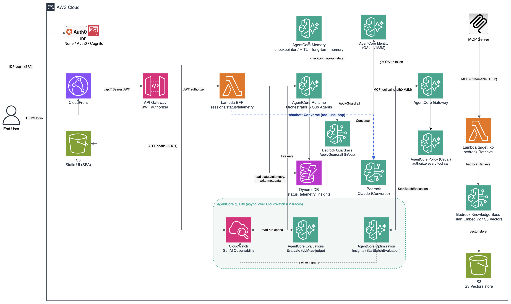

# Architecture

How AgentExpress works inside: a config-driven multi-agent orchestrator on LangGraph and
Amazon Bedrock AgentCore, plus a Builder that designs and deploys new workflows. Overview:
[README.md](README.md). Walkthrough: [GETTING_STARTED.md](GETTING_STARTED.md). Deploy
commands, IdP and RBAC setup, teardown: [DEPLOYMENT.md](DEPLOYMENT.md). Code paths are
relative to `orchestrator/`.

Contents: [Overview](#1-overview) · [Planes](#2-planes) · [Request flow](#3-request-flow-of-a-run) ·
[Runtime](#4-the-runtime) · [Images](#5-images) · [AgentCore features](#6-agentcore-features) ·
[BFF](#7-the-bff) · [Data stores](#8-data-stores) · [Deploy pipeline](#9-builder-deploy-pipeline) ·
[Config](#10-config-as-the-single-source) · [Security](#11-security-model) · [Tests](#12-tests) ·
[Known gaps](#13-known-gaps)

## 1. Overview



```
 IdP (Cognito | Auth0 | Okta | Entra ID | none)
   │ user login (SPA client)          │ client-credentials (agent → Gateway)
   ▼                                  │
 Browser SPA ─Bearer JWT─▶ CloudFront ── / ──▶ S3 (static UI)
                              │ /api/*
                              ▼
                   API Gateway (JWT authorizer) ─▶ BFF Lambda ─▶ DynamoDB
                                                    │ SigV4        ▲ status, events,
                                                    ▼              │ telemetry, audit
                   AgentCore Runtime: LangGraph graph from workflow.json
                      │              │ InvokeAgentRuntime      │ A2A (JSON-RPC)
                      │              ▼                         ▼
                      │      dedicated agent runtimes     remote agents
                      ▼              ▼
   Bedrock + Guardrails    AgentCore Gateway (MCP, CUSTOM_JWT + Cedar)
   AgentCore Memory          kb → Bedrock KB (S3 Vectors) · websearch → managed connector
   (checkpoint, long-term)   mcp → remote server · openapi/apigateway → REST · lambda

 Out of band: OTEL spans → CloudWatch (Transaction Search) → Evaluations, Insights
```

The shipped sample is 4 steps and 9 agents:

```
intake ─(HITL, branch)─▶ [knowledge_research ‖ web_search ‖ documentation_search ‖
                          cost_research ‖ lifecycle_research] ─(HITL)─▶
                         [analysis → recommendation] (A2A) ─(HITL)─▶ report
```

The five research agents show five tool patterns behind one Gateway. `analysis` and
`recommendation` are `runtime: "a2a"`, served by a stand-in remote agent (`a2a_lambda/`).
The branch on `intake` can end the run or skip to the A2A step. Both IaC paths (`cdk/`,
`terraform/`) read `app/workflow.json` and create the same resources.

## 2. Planes

| Plane | Contents | Present when |
|---|---|---|
| Workflow plane | Image, orchestrator and dedicated runtimes, memories, guardrail, Gateway and tools, KB, run tables, Transaction Search | `consoleMode=app` (default) |
| Builder control plane | Builds table, versioned builds bucket, CodeBuild deploy project, Build view, designer | `builder` on (default; `-c builder` / `enable_builder`) |

- `consoleMode=app` runs its own workflow, with the Builder beside it unless
  `builder=false`. `consoleMode=builder` (`console_mode`) is a control plane only: the
  BFF answers every run route with 404, and it fails at synth/plan without the Builder.
- Each build the Builder deploys is its own stack of this architecture with
  `builder=false`, so it has no Build view.
- `enableGateway` (CDK, default `false`) / `enable_gateway` (Terraform, default `true`)
  switches the tool plane. Without it an agent bound to a `tool` fails fast
  (`app/common/errors.py`); evidence is never invented.

## 3. Request flow of a run

1. The browser sends the IdP ID token as a Bearer on every `/api/*` call
   (`web/src/api.ts` refreshes once on a 401 and replays).
2. CloudFront forwards `/api/*` to the HTTP API; its JWT authorizer checks issuer and
   audience, so unauthenticated calls never reach the BFF.
3. The BFF (`bff/handler.py`) checks RBAC (`bff/authz.py`), writes the status item, logs
   `run.started`, and async-invokes itself (`InvocationType="Event"`).
4. That invocation calls `InvokeAgentRuntime` (SigV4) with a session id derived from the
   run id, so resumes and re-runs reach the same run. Evaluate and Insights get a fresh id.
5. The runtime (`app/orchestrator/runtime.py`) runs the graph with the AgentCore Memory
   checkpointer (`AgentCoreMemorySaver`). Agents call Bedrock and, via the Gateway, tools.
6. `app/common/sink.py` writes progress to the status table (nested-map updates, so
   parallel agents never conflict) and the events table (append-only timeline).
7. The UI polls `GET /api/sessions/{id}` every 2 s (the run list every 5 s); the snapshot
   carries the whole timeline, up to `TIMELINE_MAX` (1,000) events. At a gate
   the graph pauses on `interrupt()`; `POST /api/sessions/{id}/decision` resumes it
   through the same self-invoke path.
8. When the overall status becomes `done`, `failed` or `denied`, the sink logs
   `run.completed`, `run.failed` or `run.denied` (`app/common/audit.py`).

## 4. The runtime

### Graph from `steps`

`app/orchestrator/graph_builder.py` compiles `steps` into a graph:

| Step | Nodes | Revise goes to |
|---|---|---|
| `{"agent": id}` | agent node, optional gate | the agent |
| `{"parallel": [...]}` | fan-out, join at one group gate | only the agents the reviewer flagged |
| `{"sequence": [...]}` | chain, one gate after the last | the first agent |

- Gates (`app/orchestrator/nodes.py`) always call `interrupt()`. `approve` continues,
  `revise` stores the comment as feedback and loops, `deny` ends the run.
- `branch` (`app/common/branching.py`) adds a node that evaluates rules over a dot path
  into the agent's output JSON, records the target in the `branch` state channel (which
  the router only reads) and marks bypassed agents `skipped`. Targets are later steps or
  `END`, so the graph stays acyclic; with a gate, the branch reads the approved output.
- Each agent run is appended to a `history` channel as a numbered version with the
  comment that triggered it.

### Rewind and re-run

`rerun_plan(agent_id)` gives the node to attribute a state write to (`as_node`) and the
gate decision to force to `approve`; `runtime._rewind` applies it with `aupdate_state`
and resumes with `None`, so the agent and everything downstream re-run and downstream
gates pause again. This covers single agents, parallel-group members (the group re-runs)
and agents inside a `sequence`. `group_rerun_plan(agent_ids)` re-runs a subset of one
gated parallel step by seeding its gate to `revise` with that subset.

### Placement: `main`, `dedicated`, `a2a`

| `runtime` | Where it runs | How it is called |
|---|---|---|
| `main` (default) | in the orchestrator runtime | LangGraph node |
| `dedicated` | its own AgentCore Runtime, same image, `AGENT_ID` picks the agent (`app/subagent_runtime.py`) | `AgentCoreRuntimeAgent` → `InvokeAgentRuntime`, trace context propagated |
| `a2a` | an agent you do not operate | `app/common/a2a_agent.py`: Agent Card at `/.well-known/agent-card.json`, JSON-RPC `message/send`, `tasks/get` polling |

Each dedicated agent gets its own execution role, derived from its `agentcore` block. An
`a2a` agent has no package under `app/subagents/` and rejects `tool`, `corpus`, `model`
and `maxTokens`. The remote supplies content; `A2AAgent._as_asset` adds the envelope
(`version`, `createdByAgent`, `assetType`, `sourceAssetIds`). Guardrails apply and memory
recall travels in the task (`recalledContext`). Not available: local prompt capture for
Evaluations, Cedar over the remote's own tool calls, contract validation of the reply.

### The agent and `ctx`

An agent is an `Agent` subclass in `app/subagents/<id>/` with an `async def run()` that
receives an `AgentContext` (`app/common/context.py`):

| Call | Purpose |
|---|---|
| `ctx.llm(system, user, name=...)` | Model call with guardrails, telemetry, memory injection, `vision` images, the run's files (`attachments`), truncation warning |
| `ctx.call_tool(key, query)`, `ctx.call_tool_rows(...)` | Gateway tool call; `_rows` returns data rows rather than evidence text |
| `ctx.retrieve(query)` | KB retrieval scoped to the agent's corpus |
| `ctx.image(prompt, negative_prompt)` | Render an image ([Images](#5-images)) |
| `ctx.input(agent_id)`, `ctx.log`, `ctx.heartbeat` | Upstream output, timeline line, progress |
| `ctx.guardrail`, `ctx.memory_recall`/`memory_store`, `ctx.get_identity_token`, `ctx.get_api_key`, `ctx.policy_check` | Feature helpers, no-ops when the feature is off |

The node wrapper (`make_agent_node`) applies input and output guardrails, memory recall
and store, and figure grounding (`app/common/grounding.py` warns on the timeline about
figures that appear in no upstream asset; agents with a `tool` are exempt).

### Frameworks

`framework` is `plain` (default), `strands` or `langgraph` and selects the template
`scaffold.py agent --framework` writes for the reasoning step. All three call the model
through `ctx.llm`, where guardrails, telemetry and memory live, so a framework's own
Bedrock client and native tool loop are not used. In the sample, `web_search` reasons in
a Strands agent (`_shared/strands_bridge.py`), `knowledge_research` in a nested LangGraph
with one bounded repair step, and the rest use no framework. All emit the same contract.

### Tools and tool modes

Agents reach tools through one Gateway MCP endpoint with a client-credentials token from
the IdP. Targets and Cedar permits are generated from the `tools` block
(`terraform/tools.tf`, `cdk/lib/tool-plane.ts`). A tool's key is both its target name and
what an agent's `tool` names.

| `type` | Backend |
|---|---|
| `kb` | Lambda calling `bedrock:Retrieve` on a Bedrock KB (S3 Vectors), filtered to the agent's `doc_type` corpus |
| `websearch` | managed AgentCore Web Search connector (`connectorId: web-search`) |
| `mcp` | remote MCP server over Streamable HTTP (sample: AWS Knowledge MCP Server) |
| `openapi` | REST API from an OpenAPI schema in S3 (`schemaS3Uri`, or `source` under `app/tools/`) |
| `apigateway` | an API Gateway REST API stage in the same account and region |
| `lambda` | your function (`lambdaArn`), or code in `app/tools/<source>` that the framework deploys |

- `toolMode: "direct"` (default) queries every bound tool once before the model reasons.
  `toolMode: "model"` (`app/common/tool_loop.py`) lets the model pick tools and arguments,
  up to `maxToolCalls` (default 6). Every call still goes through the Gateway, so Cedar,
  corpus scope, fixed `args` and telemetry apply either way.
- The Gateway publishes tools as `<target>___<tool>` and `call` matches that name (hence
  `aws___search_documentation`). The client (`app/features/gateway/client.py`) follows
  `tools/list` pagination, unwraps the MCP envelope and caps evidence at
  `MAX_EVIDENCE_CHARS` (20000) per block and `MAX_RESULT_CHARS` (4000) per result.
- Skills (`skills.<name>`, `app/common/skills.py`) are added in `ctx.llm`, so every
  framework gets them. With `toolMode: "model"` and tools, the tool turn offers
  `use_skill(name, file?)`: it is not counted against `maxToolCalls` and is never evidence,
  and later calls carry the opened skills in full and the rest by name. Otherwise each
  listed skill is added in full (up to 60k characters). A skill is text; nothing in it runs.
- Research agents verify citation URLs against the evidence; an invented URL is dropped
  and a `sourced-fact` resting on it is downgraded (`_shared/research.py`).

## 5. Images

- An `output: "image"` agent's model writes a brief (prompt, negative prompt, caption);
  `ctx.image` renders it with a Stability model on Bedrock (`app/common/images.py`) in
  the deployment's region when Bedrock serves the model there, else one in the same
  geography (`imageModels.regionsByModel` in `app/vocabulary.json`; us-west-2 today).
  Outside that geography the deploy and the render are refused unless the agent sets
  `image.allowCrossRegion: true`. Priced per image from `orchestrator.imageRates`, the AWS
  Price List, then the vocabulary snapshot.
- The image goes to the deployment's assets bucket (created only when some agent draws)
  at `runs/<session>/<agent>/<n>.<ext>`. `GET /api/images` returns a 15-minute link to
  the run's owner. A filtered image raises `ImageFiltered` and fails the step; text
  guardrails and Evaluations do not inspect images.
- `vision.from` names earlier agents whose images this agent reads. `images.load_for`
  loads only keys under this run's `runs/<session>/` (`vision.maxImages`, default 4, max
  20), and `ctx.llm` sends them to the agent's model as Converse image blocks.

## 6. AgentCore features

Each feature lives in `app/features/<name>/` and is switched on per agent in its
`agentcore` block.

| Feature | How it is used |
|---|---|
| Runtime | Orchestrator and dedicated runtimes |
| Memory | One store is the LangGraph checkpointer; a second holds long-term `semantic`/`summary`. The actor is per agent, partitioned by `memory.scope` (`user` default, `subject`, `agent`, `run`) |
| Gateway | MCP endpoint for all tools; CUSTOM_JWT authorizer pinned to the caller (`allowed_clients` for Cognito; `allowed_audience` + `azp` for Auth0 and Entra ID, + `cid` for Okta) |
| Identity | Credential providers from `identities.<name>`, secrets from the environment. `gatewayIdentity: "perAgent"` gives each tool-using agent its own Gateway client |
| Policy | Cedar engine on the Gateway, `ENFORCE` (default-deny) or `LOG_ONLY`. `ctx.policy_check` is a secondary, fail-open helper |
| Guardrails | Build-wide `guardrail` block (not created if it enforces nothing), plus named `guardrails.<name>`. A block stops the agent and the timeline names the policy that blocked; an anonymize-only finding carries on with the masked text |
| Observability | OTEL with one `session.id` per run, AGENT and tool spans, force-flush per burst; a telemetry row per model, tool, memory, guardrail and policy call |
| Evaluations | LLM-as-judge per named prompt per version: telemetry rows replayed into `Evaluate` as `sessionSpans`, CloudWatch span fallback. `auto: true` scores at run end |
| Insights | Batch evaluation over recent traces; findings in the insights table |

Both IaC paths provision the named blocks (`guardrails`, `memories`, `evaluators`,
`identities`, `policies`) and enable Transaction Search (an account-wide singleton) with an
idempotent call. Token counts are exact; cost is a list-price estimate
(`app/features/observability/pricing.py`): each model call is priced from
`orchestrator.modelRates`, else the AWS Price List for the deployment's region
(`pricelist.py`, cached a day), else a built-in snapshot, else a marked fallback, and the
row records which (`rates_source`). Image renders are priced the same way per image. The Observability tab is a separate module
(`web/legacy/observability.js`) mounted by `web/src/views/Observability.tsx`.

## 7. The BFF

One Lambda (`bff/handler.py`) behind the HTTP API.

| Group | Routes |
|---|---|
| Runs | `POST/GET /api/sessions`, `GET/DELETE /api/sessions/{id}`, `/decision`, `/cancel`, `/rerun`, `/evaluate` |
| Read-only | `/api/workflow`, `/api/me`, `/api/models`, `/api/images`, `/api/sessions/{id}/telemetry`, `/api/telemetry/aggregate`, `/api/insights` |
| Assistant | `POST /api/chat` |
| Builds | `/api/builds[/{id}]`, `/deploy`, `/destroy`, `/log`, `/design`, `/secrets`, `/docs`, `/login`, `/shares`, `/test-tool` |
| Library, groups | `/api/library[/{id}]`, `/api/library/{id}/shares`, `/api/groups[/{id}]` |
| Accounts, policies | `/api/accounts[/{id}]`, `/api/policies[...]`, `/api/code/check` |
| Activity | `GET /api/audit`, `POST /api/audit/logout` |

A run can target a deployed build (`POST /api/sessions` with `{"build": id}`); per-run
routes then find the build from the run. The API uses one API-wide Lambda permission
(`scopePermissionToRoute: false` in CDK, one `aws_lambda_permission` in
`terraform/bff.tf`) because per-route statements exceed Lambda's 20 KB policy limit.

**Authorization.** `bff/authz.py` maps the JWT groups claim (`groupsClaim`) to eleven
actions from `app/vocabulary.json`: `start`, `decision`, `rerun`, `cancel`, `evaluate`,
`insights`, `delete`, `deploy`, `destroy`, `audit`, `admin`. Unlisted means open, listed
needs one of the groups, an empty list denies everyone. `audit` and `admin` are closed
unless granted; `insights` is closed whenever anything else is restricted. Runs are
private to their starter and builds to their owner unless shared (others get 404);
`admin` may read, never act on, anyone's runs and builds. `GET /api/me` returns
`permittedActions` so the UI hides what the caller cannot do; the server still checks.

**Run Assistant** (`bff/chatbot.py`, `web/src/views/Assistant.tsx`): a Bedrock Converse
tool-use loop in the BFF, so it answers while a run is paused. It sees only the caller's
runs and can approve gates, re-run agents and start evaluations; tools the caller's
groups do not permit are withheld. Configured by `orchestrator.chatbot`.

**AgentExpress Assistant** (`bff/designer.py`, `web/src/builder/DesignChat.tsx`): the
Builder's designer. `POST /api/builds/{id}/design` stores the message and hands the turn
to a background self-invocation; the page polls. The model changes the latest draft only
through `apply_changes` and `undo_last_change`, each result checked by
`bff/validate_build.py`, with the build's library items resolved as the deploy resolves them,
and up to 3 fix rounds. Its context lists the caller's library (`library.list_items`), so it
reuses an item by id rather than writing a new one, and never edits one the build uses. Its edits reach what the tabs reach:
agents, steps, tools and their code, the named maps (skills included), triggers,
interceptors (their code generated from the templates by `bff/interceptor_code.py`, a
byte-for-byte port of the tab's generator), and items from the organization's AWS Agent
Registry, which it finds with a read-only `search_registry` tool and imports by record id
(the server builds the entry). Publishing to the registry stays an admin's button. The
model is Claude Sonnet 5.5 at medium reasoning effort, falling back to Claude Sonnet 5 when the account may not call 5.5
(`DESIGNER_MODEL`, a `model[:effort]` list, and `DESIGNER_EFFORT`). Replies stream (ConverseStream) into
the conversation file the page polls: the text as it is written, each edit of a change as it
is written ("Adding agent x"), and the canvas reloads as each change is saved. A turn that
passes 180 s in one invocation carries on in a fresh one (up to 3 more) from the saved
draft instead of stopping. It has no deploy or publish tool.

**Library and sharing** (`bff/library.py`, `bff/sharing.py`, `bff/builds.py`):

- A build references a library item (tool, skill, guardrail, memory, evaluator, identity,
  policy) as `{"library": "<id>"}` in place of the entry. It is resolved live on build
  GET, in the designer's validation and at deploy, which freezes a resolved snapshot
  into the version. The build's `META` records `libraryUses`; deleting an item detaches
  it, giving each build that used it its own copy first. Secrets are never in an item.
- `shares = {emails, groups, everyone}` on a build or item, with `SHARE#…` pointer items
  for listing. A share grants everything the owner may do; groups are admin-defined.
  Every save bumps `rev`, and a save based on a stale `rev` gets 409.

**AWS Agent Registry** (`bff/registry.py`, `bff/builds.py`): the registries in the
console's account and region. Search reads only APPROVED records (the discoverable API);
`to_entry` maps an MCP record to an `mcp` tool (an https streamable-HTTP remote; its tools
as `toolSchema`; never auth), an A2A card to a `runtime: "a2a"` agent and a SKILL.md to a
skill, each carrying `registry {registryId, recordId, name, version, sync}`. A record's URLs
are never fetched. Items with `sync` are refreshed on `GET /api/builds/{id}/registry` and in
the deploy after `library.resolve`; an update replaces only the registry's fields
(`_TAKES`). `POST /api/builds/{id}/publish` (admin) writes the deployed version as an AGENT
record (a `custom` descriptor: the workflow and its app URL; a build is not an A2A server)
and an MCP record for its Gateway (`gatewayUrl`, tools as `<key>___<name>`, person tools
left out), or a skill as a SKILL record, each as `n.0.0`, and submits them for approval;
destroy deprecates the build's records. The Lambda's boto3 predates the API, so its models
ship in `bff/botocore_data/` as a fallback search path.

**Activity log.** Three best-effort writers share one item layout
(`bff/buildstore.audit_items`) in the table named by `AUDIT_TABLE`: the BFF
(`bff/audit.py`) writes request events (run start, decisions, cancels, re-runs, deletes,
sign-outs, build, library, sharing, account and policy changes); the runtime writes
`run.completed`, `run.failed` and `run.denied` (`app/common/audit.py`, called from
`app/common/sink.py`); the Cognito post-auth trigger (`signup_lambda/`) writes sign-ins.
The runtime and trigger carry copies of `audit_items`; `tests/test_run_audit.py` holds
the runtime copy to the BFF's. A user reads their own log; everyone's needs `audit`.

## 8. Data stores

Table names are `<agentName>_<suffix>`; a build's `agentName` is `ax_` + 8 hex.

| Store | Key | Contents |
|---|---|---|
| `_status` | `session_id` | Run status: overall, per-node status and outputs, owner |
| `_events` | `session_id`, `ts` | Append-only timeline |
| `_telemetry` | `session_id`, `sk` (`ts#seq#uuid`), GSI `by_date` | Per-call rows with agent-run version and prompt name |
| `_insights` | `id` | Cross-run Insights findings |
| `_audit` | `pk`, `sk` | Activity log, only when there is no builds table (a build's own app) |
| `_builds` | `pk`, `sk`, GSI `by_owner` | Builder items, below |
| AgentCore Memory | | Checkpoints (HITL pause/resume) and long-term memory |

| `pk` | `sk` | Item |
|---|---|---|
| `BUILD#<id>` | `META` | Name, owner, `rev`, `libraryUses`, shares, last `job`, `deployed` |
| `BUILD#<id>` / `RUN#<sid>` | `RUN#<sid>` / `BUILD` | Run ↔ build links |
| `USER#<sub>` | `ACCOUNT#<n>`, `LIB#<id>` | Connected accounts, library pointers |
| `LIB#<id>` | `META` | Library item: kind, definition, files, owner, shares |
| `SHARE#EMAIL#<e>`, `SHARE#GROUP#<g>`, `SHARE#ALL` | `<KIND>#<id>` | Share pointers |
| `GROUPS` | `<name>` | Admin-defined group and member emails |
| `AUDIT#<sub>`, `AUDIT_DAY#<date>` | `<ts>#<rand>` | Each audit event, under the user and under the UTC day |

- Builds bucket (versioned): `builds/<id>/draft.json`, `versions/<n>.json` (immutable),
  `kb/<corpus>/…`, `design.json`, `design-rev/<n>.json`; `connect/<externalId>.json`;
  `tfstate/<owner>/<id>/…`. Secrets Manager holds a build's tool keys, A2A tokens and
  `-login` secret.
- Assets bucket: `runs/<session>/<agent>/<n>.<ext>` (images); a run's files under
  `runs/<session>/attachments/` (copied in by `bff/runfiles.py` when it starts, read by agents
  with `attachments`); uploads under `uploads/<owner digest>/`, expired after a day. Also UI,
  KB documents and tool schema buckets.

## 9. Builder deploy pipeline

```
Build view / designer ── PUT /api/builds/{id} ──▶ builds/<id>/draft.json
        │ POST /api/builds/{id}/deploy {tool: cdk|terraform}
        ▼
BFF: resolve library refs, validate_build, code and region checks,
     freeze builds/<id>/versions/<n>.json, start CodeBuild
        ▼
deployer/runner.py, on a fresh copy of the framework:
  1. fetch version n
  2. scaffold.py apply <bundle> --exact     (tree mirrors that version only)
  3. cdk deploy | terraform apply  (agentName=ax_…, idp=cognito, createCognito=true,
     builder=false, enableGateway when the workflow has tools)
  4. record deployed on BUILD#<id> META; audit deploy.succeeded | deploy.failed
```

- Versions count successful deploys, so a failed attempt retries the same number from a
  newly frozen bundle. Destroy runs the same steps with the tool the build deployed with.
- Connected accounts (`bff/accounts.py`): the user launches a stack creating
  `AgentExpressDeploy-<id>`, which trusts only this console's deploy project and BFF and
  requires a per-user External ID. The runner assumes it for the job.
- Failed first create: before a CDK deploy the runner deletes a stack in
  `ROLLBACK_COMPLETE`, `ROLLBACK_FAILED` or `DELETE_FAILED`. A stack that ever deployed
  is never touched.

## 10. Config as the single source

```
app/keys.json + app/vocabulary.json ─▶ build_schema.py ─┬─▶ app/workflow.schema.json  (editor)
                                                        ├─▶ app/defaults.json         (runtime, CDK, Terraform)
                                                        └─▶ web/src/generated/builder-meta.json (Build view)
```

- `app/workflow.json` is the customer's file: `orchestrator`, `ui`, `guardrail`,
  `authorization`, `tools`, `agents`, `steps`, plus optional named blocks.
- `app/keys.json` describes every key: placement, required, default, what reads it.
  `build_schema.py --check` fails CI on drift; `format_workflow.py` orders keys.
- `app/vocabulary.json` holds the closed value sets (runtimes, tool types, frameworks,
  tool modes, memory strategies, RBAC actions, image models and more), read by Python,
  `cdk/lib/vocabulary.ts` and Terraform (`jsondecode(file(...))`).
- Validator parity: the Build view's `web/src/builder/validate.ts` and its port
  `bff/validate_build.py` run the same fixture, `tests/fixtures/validation_cases.json`.
- IaC parity: `cdk/test/parity.test.ts` reads the HCL and compares route sets,
  tool-plane shapes, IAM grants and Cedar policy names, and asserts every plane reads
  `app/vocabulary.json`. The BFF workflow projection has one implementation
  (`bff/workflow.py`). Runtime and Memory are raw `CfnResource` in CDK and `awscc_*` in
  Terraform; the other AgentCore resources use the L1s and `aws_bedrockagentcore_*`.

## 11. Security model

- One `idp` drives user login, the API authorizer and the agent → Gateway token.
  `idp = "none"` is an open UI and API for sandboxes; both IaC paths refuse it without
  `allow_unauthenticated` / `-c allowUnauthenticated=true`, and reject it with restricted
  actions. Cedar authorizes agents calling tools, `bff/authz.py` people
  acting on runs and builds; BFF → runtime is IAM/SigV4.
- Runs, builds, library items and connections are private to their owner unless shared
  (404 otherwise). There is no tenant boundary beyond that. A run a service trigger
  started (`runAs: "service"`) belongs to the trigger; its `approvers` groups read and decide it.
- One route has no JWT: `POST /api/hooks/{name}`, a webhook trigger's delivery
  (`bff/triggers.py`). Its proof is an HMAC signature of the body with the trigger's secret
  (Secrets Manager, set from the app's Triggers page), checked before anything else is read,
  with a freshness window, a per-delivery idempotency key, an hourly run cap and its own
  stage throttle. Schedules, EventBridge rules and SQS mappings invoke the BFF directly,
  scoped by rule ARN or queue. A gate answered by event (`bff/gates.py`) takes an
  "AgentExpress Approval Decision" event for this app: whoever may put events on the
  account's default bus may decide it.
- AWS Agent Registry: anyone may search and import (read only, like the library);
  publishing speaks for the organization, so it needs `admin`, and the console never
  approves its own records. An imported MCP tool gets no credentials until the author
  sets how it connects.
- Gateway interceptors (`orchestrator.interceptors`) are Lambdas the Gateway role alone may
  invoke; one written in the build is deployed like a code tool (its own role, a boundary
  denying the framework's data). With `passRequestHeaders` they see the agent's Gateway
  token and the `x-ax-*` run headers.
- Least privilege: a role per dedicated agent, connected-account roles without
  AdministratorAccess, console roles scoped to `ax_*` resources. The console deploy role
  cannot edit its own role or policies. A code tool's grants reach only resources tagged
  `agentexpress:code-tools=true`, under a boundary that denies the framework's own data.
- Credentials: each runtime reads its Gateway client secret(s) and A2A tokens from its own
  Secrets Manager secret (`RUNTIME_SECRET_ARN`, `app/common/runtime_secret.py`).
- Baseline: PITR on every table, TLS-only encrypted buckets, API access logs and a throttle,
  CloudFront security headers, Cognito 12+ character passwords with optional TOTP MFA,
  pinned dependencies (`requirements.lock`) and base image, an immutable ECR repository.
  cdk-nag (`cdk/lib/nag.ts`) and checkov (`terraform/.checkov.yaml`) list what is accepted.
- Before production: add WAF and a custom domain; revisit `force_destroy` buckets; replace
  the sample guardrail and Cedar rules; limit telemetry capture (it stores prompts and
  outputs; `OBS_MAX_CAPTURE_CHARS`, TTL); disable assistant action tools
  (`orchestrator.chatbot.tools`) if it should not act. Treat model, MCP and RAG output
  as untrusted.

## 12. Tests

| Suite | Runner | Count | Covers |
|---|---|---|---|
| `tests/` | pytest | 1526 | Graph compilation, branching, rewind, tool calls, citations, grounding, contracts, RBAC on every route, validator parity, images, audit; Builder BFF on moto DynamoDB and S3 |
| `cdk/test/` | jest | 315 in 7 files | Projections, validators, synthesized template, Terraform ↔ CDK parity, cdk-nag |
| `web/` | vitest | 409 in 43 files | Asset renderer, token refresh, gates, Builder views, validator parity |

None need AWS credentials. Prompt quality is not unit-tested; the HITL gates and
Evaluations cover it. Each suite's directory has a `README.md`.

## 13. Known gaps

Dedicated-agent calls are synchronous (long-running agents would need poll/resume). Runs
are filtered by an `owner` attribute, not partitioned by tenant. The UI polls rather than
receiving pushes. AgentCore Optimization recommendations are not wired; Insights is used.
